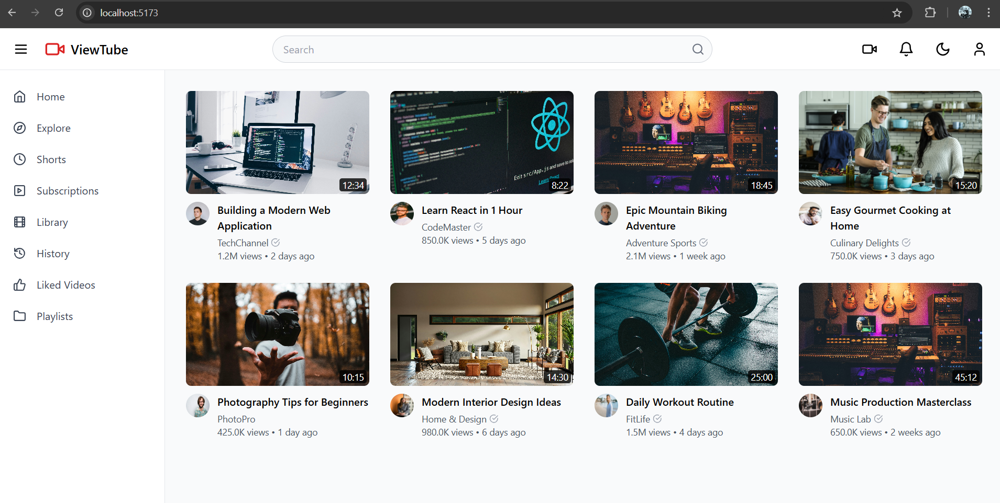

# YouTube Clone (Home Page)

This is a YouTube Clone project built using **React**, **Vite**, and **TypeScript**. The project replicates the **Home Page** of YouTube, displaying a grid of video thumbnails and titles. It is designed to be fully responsive and scalable.

## Features

- **Home Page UI**: Displays video thumbnails with titles, similar to YouTube’s home screen.
- **Responsive Layout**: The page adapts to different screen sizes (mobile, tablet, desktop).
- **Simulated Video Data**: The project simulates fetching video data and displaying it as cards.

## Technologies Used

- **React**: JavaScript library for building user interfaces.
- **Vite**: Build tool for modern web development.
- **TypeScript**: Type-safe language built on JavaScript for better development experience.
- **CSS**: For styling the layout and components.

## Installation

Follow these steps to set up and run the project locally:

1. **Clone the repository**:
   ```bash
   git clone https://github.com/MounishapothUla/YouTube-Clone.git

2. **Navigate into the project folder**:
   ```bash
   cd project
3. **Install the required dependencies**:
   ```bash
   npm install
4. **Run the development server**:
  ```bash
   npm run dev
```
## Screenshot
Here’s a preview of the Home Page of the YouTube Clone:



## Contributing
Feel free to fork this repository, submit issues, or send pull requests. If you have any ideas for improvement, feel free to open an issue.

## Acknowledgments
This project is inspired by YouTube’s layout and user experience.
Special thanks to the React and Vite communities for providing excellent resources and tools.


